*********
Ink Panel
*********

Configuration tab
=================

In the Ink panel, select the *Configuration* tab to change inklecate's
configuration settings.

.. image:: img/ink_panel/ink_panel_configuration.png
    :align: center
    :alt: Configuration tab.

|

.. note::

    The configuration settings defined in this tab are saved in
    ``.inkgd_compiler.cfg``. If you work in a team, it's recommended to keep
    this file out of version control, as the environment may differ between
    members.

Basic Configuration
-------------------

To let plugin know where inklecate is located, click on the folder icon opposite
of the *Executable* field and navigate to the desired binary. You can also paste
the path directly in the field.

Click on *Test configuration*. If the selected executable is valid, a
dialog will appear and confirm that inklecate was successfully executed by the
plugin. Otherwise, an error dialog will appear, containing the output of the
command that inklecate tried to execute.

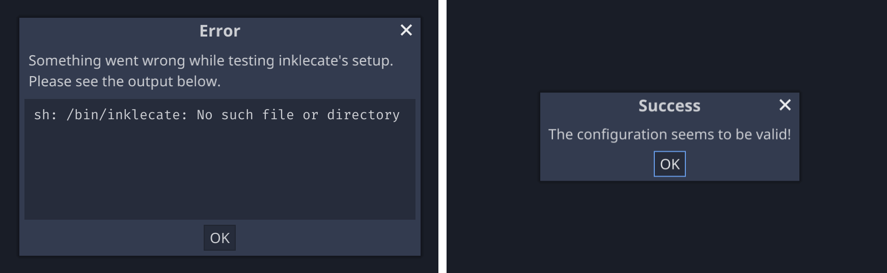

|

Recompilation Modes
-------------------

The editor plugin supports three recompilation mode.

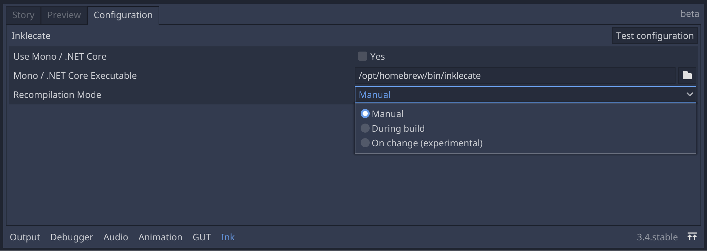

|

Manual
    the stories are never recompiled by the plugin. This is the default mode.

During build
    the stories are recompiled each time the project is run.

On change
    an experimental feature, recompiling the stories when changes are detected
    in ink files. For more information, see :ref:`below <watched-directory>`.

.. note::

    *On change* is an experimental mode, use with caution.

Custom Mono / .NET Core Runtimes
--------------------------------

On platforms other than Windows, advanced users can use specific versions of
.NET runtimes or custom inklecates that don't come bundled with a Mono runtime.
By ticking the *Use Mono / .NET Core* checkbox, a new configuration field will
appear. This field expects a path to the .NET runtime you want to use.

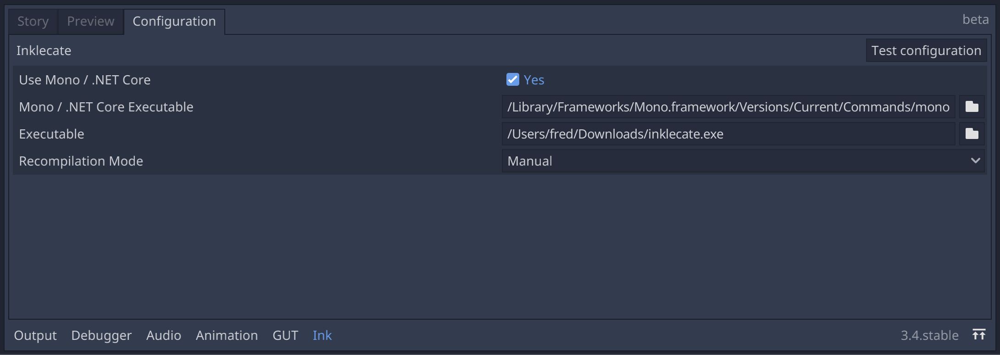

|

Story tab
=========

In the Ink panel, select the *Story* tab to let the plugin manage Ink stories
in the project.

.. note::

    The configuration settings defined in this tab are saved in
    ``.inkgd_ink.cfg``. If you work in a team, it's important to commit this
    file.

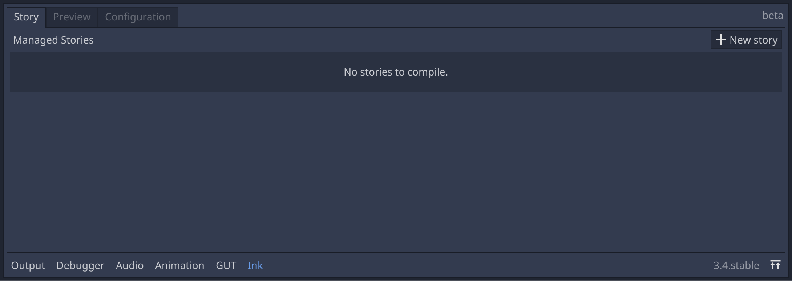

|

There should be no stories yet, so click on *New Story* to start registering
new stories.

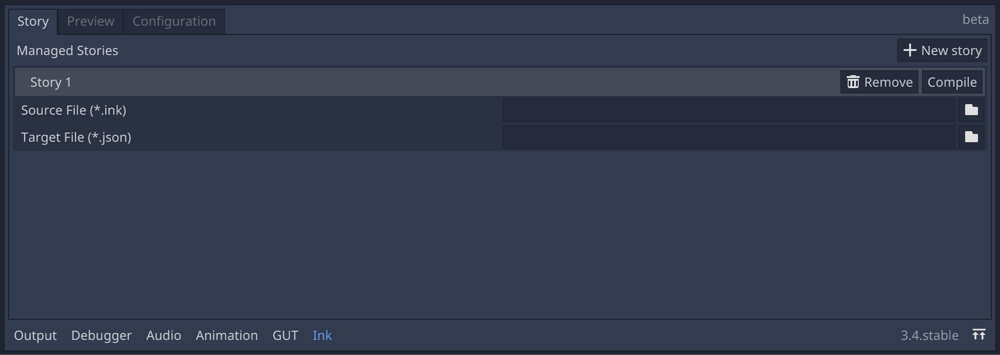

|

To manage stories, the plugin expect two paths. The path to the main ink file
that should be compiled (*Source File*) and where to write the compiled story,
(*Target File*). Both files need to be inside the project's file system, thus
they can be accessed through the regular ``res://`` scheme. To set the path of
the source file, either click on the folder icon or paste the path in the field
directly.

When the source file path is defined, the plugin populates the *Target File*
field with a default location.

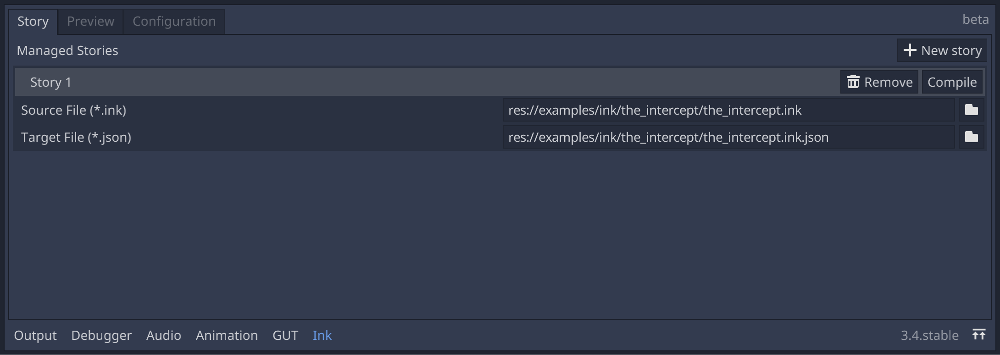

|

You can add as many stories as you want and compile them individually clicking
on each *Compile* button.

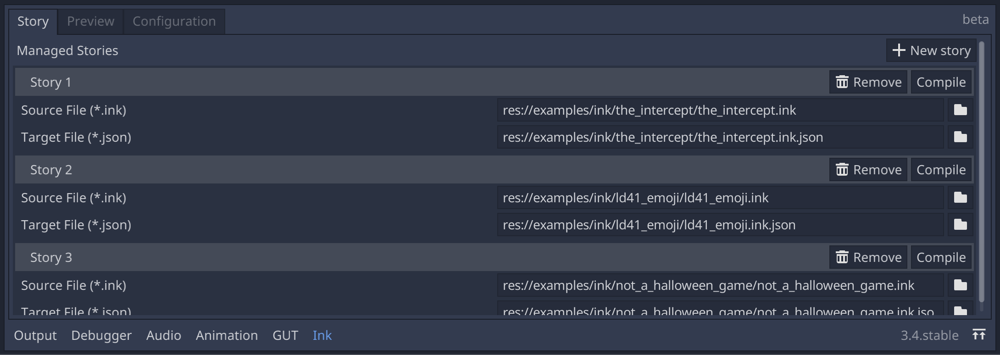

|

When the selected recompilation mode is *On change*, each entry shows an
additional field specifying which folder to watch. Any *\*.ink* file under that
folder that is reimported by Godot (i. e. changed externally) will trigger a
recompilation.

.. _watched-directory:

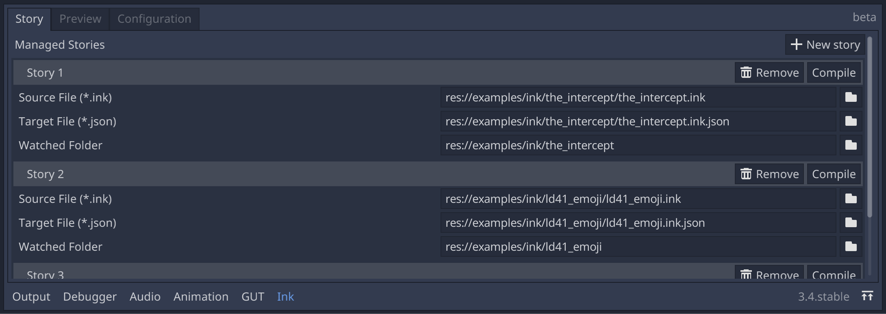
          configuration field.

|

The Preview tab
===============

In the Ink panel, select the *Preview* tab to preview a story. You can load
any valid JSON through *Load new…*.

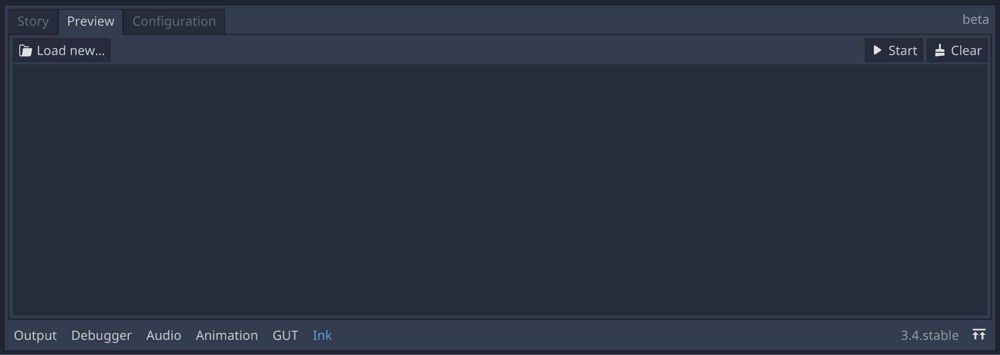

|

Unmanaged stories appear in a dropdown menu once they are loaded.

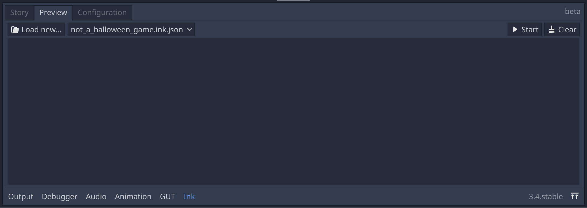

|

Managed stories appear automatically in the drop down menu as soon as they are
registered.

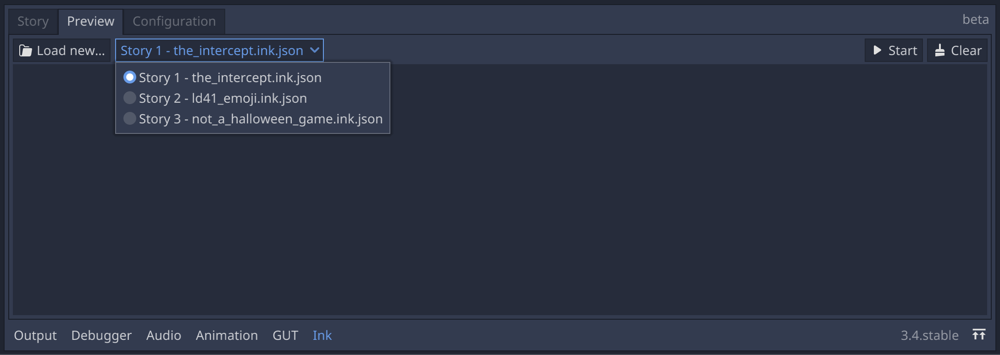

|

To start a preview, select a story from the drop down menu and press *Start*.
At any point during the execution, you can press *Clear* to remove all the
previous lines.

The previewer automatically unfolds the story until it encounters a branch.
When input in required, choices are displayed on the right side as buttons.

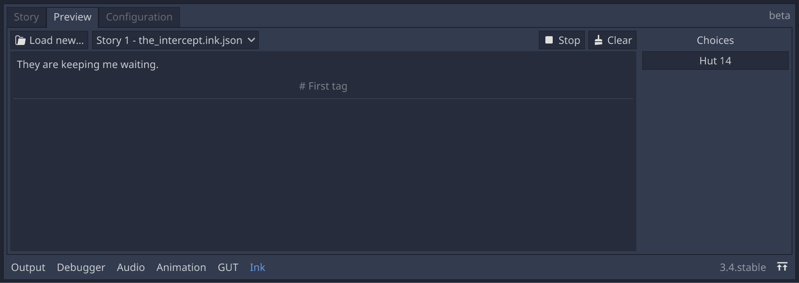

|

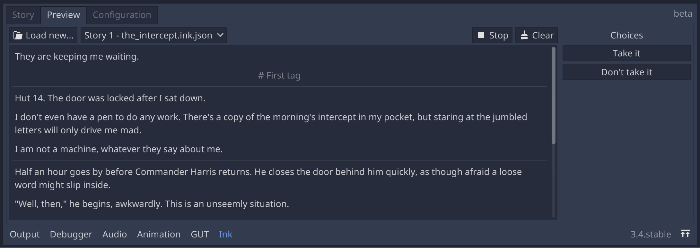

|

Any error encountered during the execution of the preview is printed to
the output console.
