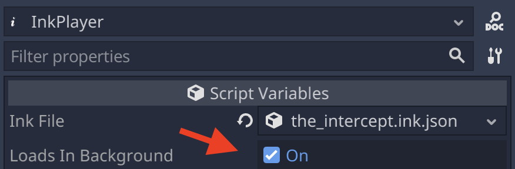

*InkPlayer* node
================

Activating the editor plugin will register a custom node that greatly simplifies
the use of Ink in Godot. While it's possible to instantiate ``story.gd``
directly, it's highly recommended that you use ``InkPlayer`` instead.

``story.gd`` is a direct port of ``Story.cs``, to use it in any engine, a bit
of boilerplate code is necessary. ``InkPlayer`` takes care of that boilerplate
so you can focus on building your game.

``the_intercept.tscn`` and ``the_intercept.gd`` contain a real world example of
how ``InkPlayer`` can be used. They are found in the `example directory`_.

.. _`example directory`: https://github.com/ephread/inkgd/tree/main/examples

Main differences between *InkPlayer* and *story.gd*
---------------------------------------------------

1. The node takes a resource as its input, rather than a string containing
   the JSON bytecode.

2. The node unifies Ink original handlers, *inkgd* custom signals and custom
   story flow signals under a same set of consistent signals.

3. The node adds convenience methods to save and load the story state.

4. The node simplifies certain APIs.

5. Finally, the node can easily be added to a scene!

Exposed signals
---------------

.. TODO: Replace this section with the API documentation.

``exception_raised(message: String)``
    Emitted when the ink runtime encountered an exception. Exception are
    usually not recoverable as they corrupt the state.

``story_error(message: String, type: int)``
    Emitted when the story encountered an error. These errors are usually
    recoverable.

``loaded(successfully: bool)``
    Emitted with ``true`` when the runtime had loaded the JSON content and
    created the story. If an error was encountered, ``successfully`` will be
    ``false`` and error will appear in Godot's output.

``continued(text: String, tags: Array)``
    Emitted with the text and tags of the current line when the story
    successfully continued.

``prompt_choices(choices: Array)``
    Emitted when the player should pick a choice.

``choice_made(choice: Array)``
    Emitted when a choice was reported back to the runtime.

``function_evaluating(function_name: String, arguments: Array)``
    Emitted when an external function is about to evaluate.

``function_evaluated(function_name: String, arguments: Array, text_output: String, result: Variant)``
    Emitted when an external function evaluated.

``path_string_choosen(path: String, arguments: Array)``
    Emitted when an external function evaluated.

``ended()``
    Emitted when the story ended.

Loop-based vs. signal-based flow
--------------------------------

``InkPlayer`` can be used in two different ways. The example below are
incomplete and assume the story is already loaded. For a working example,
take a look at ``the_intercept.gd`` in the `example directory`_.

.. _`example directory`: https://github.com/ephread/inkgd/tree/main/examples

Loop-based
**********

This is the traditional way, recommended by the creator of Ink.

.. code-block:: gdscript

    onready var _ink_player = $InkPlayer

    func _ready():
        _ink_player.connect("loaded", self, "_story_loaded")
        _ink_player.create_story()

    func _story_loaded(successfully: bool):
        if !successfully:
            return

        _continue_story()

    func _continue_story():
        while _ink_player.can_continue:
            var text = _ink_player.continue_story()

            # This text is a line of text from the ink story.
            # Set the text of a Label to this value to display it in your game.
            print(text)

        if _ink_player.has_choices:
            # 'current_choices' contains a list of the choices, as strings.
            for choice in _ink_player.current_choices:
                print(choice)

            # '_select_choice' is a function that will take the index of
            # your selection and continue the story by calling again
            # `_continue_story()`.
            _select_choice(0)

        else:
            # This code runs when the story reaches it's end.
            print("The End")

Signal-based
************

Using signals makes the code a little bit more idiomatic for Godot. It's also
more flexible.

.. code-block:: gdscript

    onready var _ink_player = $InkPlayer

    func _ready():
        _ink_player.connect("loaded", self, "_story_loaded")
        _ink_player.connect("continued", self, "_continued")
        _ink_player.connect("prompt_choices", self, "_prompt_choices")
        _ink_player.connect("ended", self, "_ended")

        _ink_player.create_story()

    func _story_loaded(successfully: bool):
        if !successfully:
            return

        _ink_player.continue_story()

    func _continued(text, tags):
        print(text)
        _ink_player.continue_story()

    func _prompt_choices(choices):
        if !choices.empty():
            print(choices)

            # In a real world scenario, _select_choice' could be
            # connected to a signal, like 'Button.pressed'.
            _select_choice(0)

    func _ended():
        print("The End")

    func _select_choice(index):
        _ink_player.choose_choice_index(index)
        _continue_story()

Loading the story from a background thread
------------------------------------------

For bigger stories, loading the compiled story into the runtime can take a
long time (more than a second). To avoid blocking the main thread, you may
want to load the story from a background thread and display a loading indicator.

Fortunately, ``InkPlayer`` supports loading the story in a thread out of the
box. Either tick *Loads In Background* in the inspector or set
``loads_in_background`` to ``true`` in code.

          Background".
    :scale: 50 %

|

On platforms that don't support threads, the feature is automatically disabled
regardles of the value of ``loads_in_background``.
