.. Intention: provide the necessary information to setup Ink on Godot. We should not say
   how to install Ink on any platform, but how to configure Ink to be used within Godot.

Introduction
============

This article will help you figure out how to start using Ink with GDScript in Godot.

What is *inkgd*?
****************

*inkgd* is `Ink <https://github.com/inkle/ink>`__ for Godot, more precisely GDScript. It's a GDScript API that you import as an addon in your Godot project that can read an Ink story (file with .ink.json suffix) and execute Ink's methods directly in GDScript. With *inkgd* you'll be able to load your story and get the text from each knot, choice and diverts, then use the text as-is. It also binds variable changes and external functions with custom functions found in your Godot scripts.

A normal use of *inkgd* would be to load a compiled story in ``.ink.json`` and call ``continue_story`` until a branch is found. Here the choices are read as an array of strings and the story waits for you to input a choice. Once you submit the selected choice (represented by the index of the choices array) to the story, you repeat the process (i.e. keep calling ``continue_story`` until a branch is found).

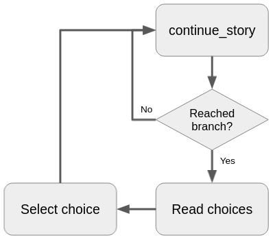

Remember that this API only provides the text, it does not provide a graphical representation of the Ink story. That's up to you.

Installing the addon
********************

You have two ways of installing this addon: the easy and convenient way or the slightly more difficult way.

The easy way
------------

Open a new Godot project, then navigate to "AssetLib" on the top of the screen, search for "inkgd".

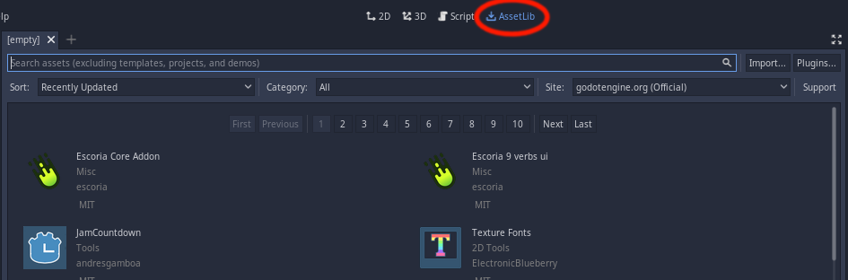

Select "inkgd" from author "ephread".

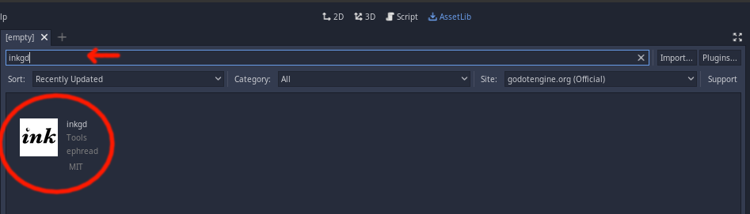

In the popup screen click "Download".

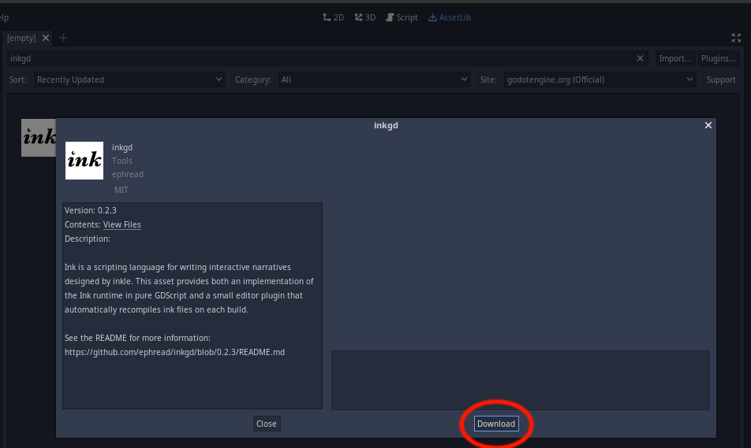

Once the addon is downloaded to your computer a popup screen will show up, this describes the new files it'll add to your project. By default it should select everything, if this is not the case then select all files, click "Install".

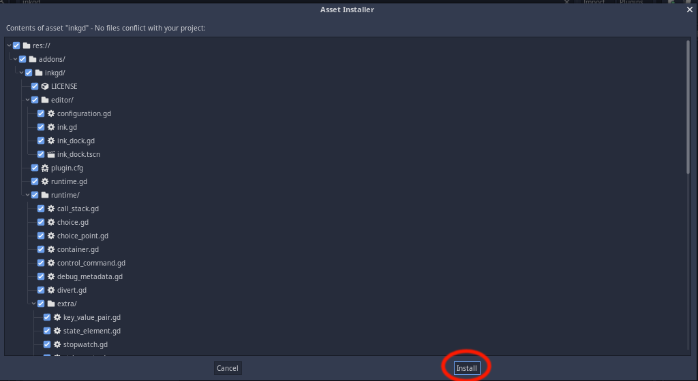

After the installation is done a popup message will show saying the addon was added to your project, click "Ok" to close it.

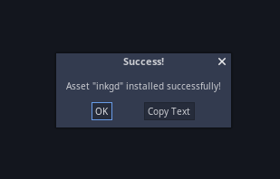

You can see the added files in your file explorer, *inkgd* will be under the *addon* folder.

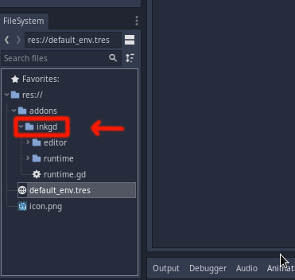

*inkgd* also comes with a convenient Ink editor which you can use within Godot, you can enable this plugin in Project > Project Settings > Plugins. This is not required to use *inkgd* API though, you can still compile your Ink stories with other Ink editors (such as `Inky <https://github.com/inkle/inky/releases/tag/0.12.0>`__) and use the compiled version with *inkgd* (``.ink.json`` files).

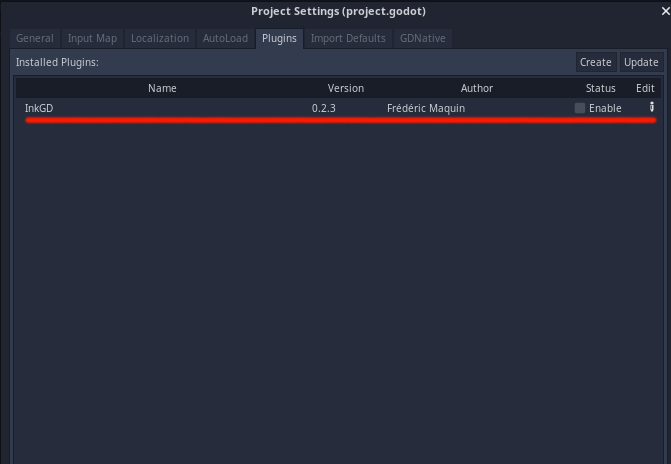

The slightly difficult way
--------------------------

Use git to clone this repository:

.. code-block:: console

    $ git clone https://github.com/ephread/inkgd.git

Or download the latest `stable version <https://github.com/ephread/inkgd/tags>`__ of *inkgd*. Then extract the contents of the archive.

Once you have the contents of the repository in your machine, copy the folder "addons/inkgd" to your project at "res://addons/". You should now have a path with all the contents of the addon at "res://addons/inkgd".

Initial configuration
*********************

In order to always have the API running in the background, *inkgd* runs as a singleton in your Godot project. This means each time your project runs an instance of *inkgd* runtime (res://addons/inkgd/runtime/static/ink_runtime.gd) runs along with your main scene. It doesn't matter if you change scenes, *inkgd* runtime will always be running independently of which scene is running. This is why it needs to initialize once at startup and removed when your project exits.

Add "addons/inkgd/runtime.gd" as a singleton in your project, this will take care of all the initialization of *inkgd* for us.

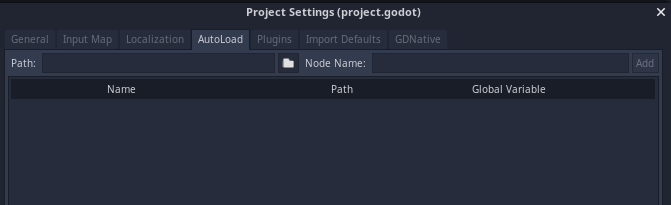

|

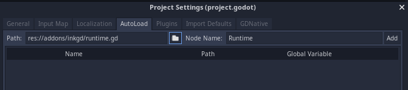

|

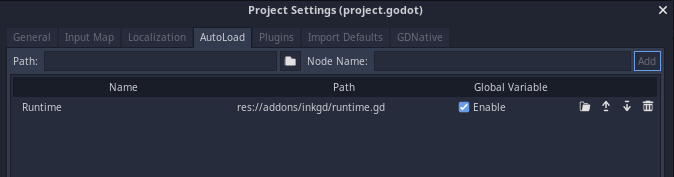

|

That's it! You can now start using *inkgd* on your Godot scripts. Jump over to the next section to create your first game with *inkgd*.
