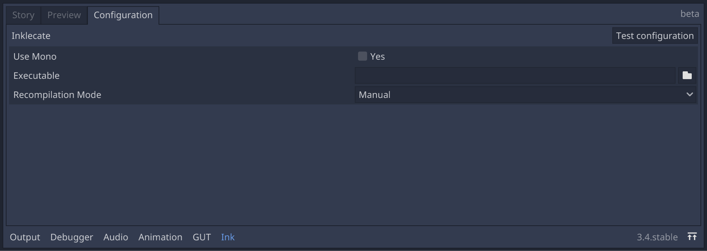
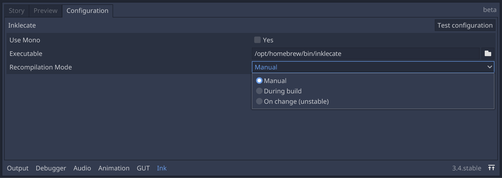
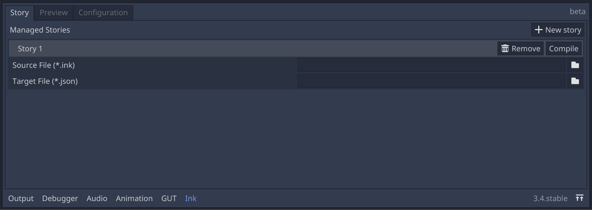
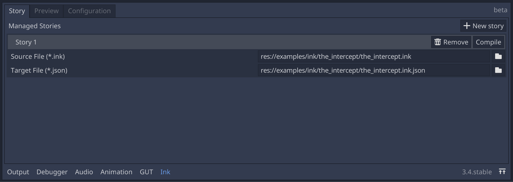
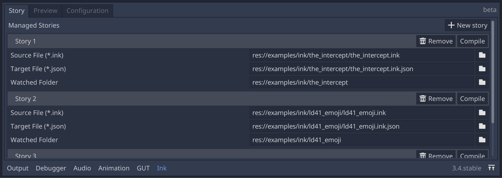
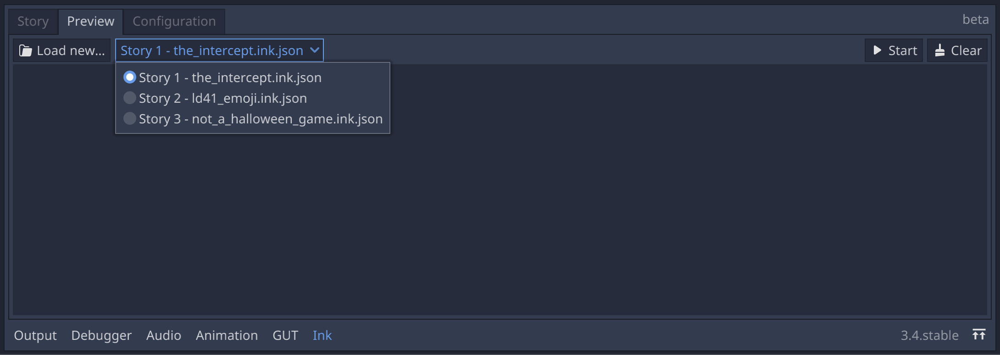
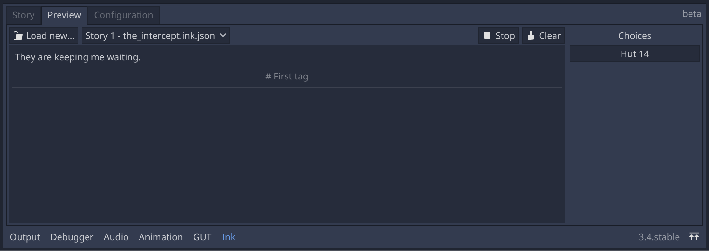
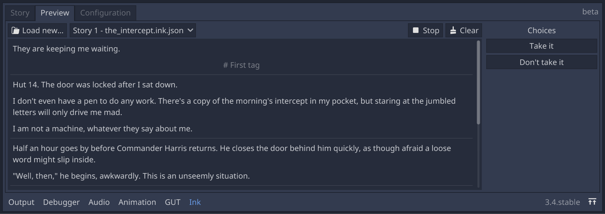

Ink panel
================

*inkgd* ships with a fully-featured editor plugin taking a the from of a new tab
in the bottom panel.

.. note::
    inklecate_ is required to take advantage of the panel.

.. _inklecate: https://github.com/inkle/ink/releases

If the plugin is not already available, navigate to
"Project" > "Project Settings" and, in the "Plugins" tab, change the status
of "InkGD" to "active".

A new tab should appear in the bottom panel.

.. image:: img/ink_panel/ink_panel_empty.png
    :align: center
    :alt: Story tab with no stories registered.

|

The Configuration tab
*********************

In the Ink panel, select the "Configuration" tab to change inklecate's
configuration settings.

|

|

:Manual: the stories are never recompiled by the plugin.
:During build: the stories are recompiled each time the project is run.
:On change:
    an experimental feature, recompiling the stories when changes are detected
    in ink files. For more information, see :ref:`below <watched-directory>`.

By clicking on "Test configuration", you can test that the plugin can
successfully run inklecate.

.. note::

    On platform other than Windows, you can force inklecate to run through Mono
    or dotNET by enabling "Use Mono". Ticking the checkbox will make another
    field appear, specifying the path the Mono/dotNET executable.

The configuration settings defined in this tab are saved in
`.inkgd_compiler.cfg`. If you work in a team, it's recommended to keep this file
out of version control, as the environment may differ between members.

The Story tab
*************

|

|

.. image:: img/ink_panel/ink_panel_three_stories.png
    :align: center
    :alt: Story tab with three stories registered.

|

You can also compile the stories manually by clicking on each "Compile" button.

The configuration settings defined in this tab are saved in `.inkgd_ink.cfg`.
If you work in a team, it's important to commit this file.

.. _watched-directory:

          configuration field.

|

The Preview tab
***************

.. image:: img/ink_panel/ink_panel_preview_no_stories.png
    :align: center
    :alt: Preview tab, with no stories registered.

|

.. image:: img/ink_panel/ink_panel_preview.png
    :align: center
    :alt: Preview tab, with stories registered.

|

|

|

|