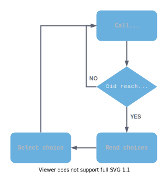

.. Intention: provide the necessary information to set up Ink on Godot.
   We should not tell how to install Ink on any platform, but how to configure
   Ink to be used with Godot.

Introduction
============

*inkgd* is an implementation of the Ink_ runtime, in pure GDScript.

If you are not familiar with Ink, it's a good idea to take a quick look at
two documents from the original documentation:

- `Writing with Ink`_ – which describes how to write Ink stories;
- `Running your Ink`_ – which describes how to integrate the Ink runtime in a C# environment.

.. _Ink: https://github.com/inkle/ink
.. _`Writing with Ink`: https://github.com/inkle/ink/blob/master/Documentation/WritingWithInk.md
.. _`Running your Ink`: https://github.com/inkle/ink/blob/master/Documentation/RunningYourInk.md

The GDScript API is 100% compatible with the original C# API, except for a
couple of minor divergences to accomodate the differences between the two
languages. For more information, see :doc:`/advanced/differences_between_api`.

.. note::

    *inkgd* provides no GUI, only text. It's up to you to decide how to present
    the content to your players.

Playing a story typically involves calling ``InkPlayer.continue_story()`` until
a branch is found, then presenting an array of choices to the player and
reporting back the selected choice through its index. Finally, repeating the
process from the beginning (i. e. calling ``continue_story()`` until another
branch is found).

.. flowchart.svg contains an editable copy of the original diagram.
.. if you need to edit it, you can load it up in draw.io.

|

--------------------------------------------------------------------------------

Click on the *Next* button to discover how to install *inkgd*!