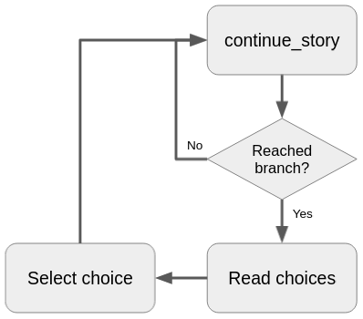
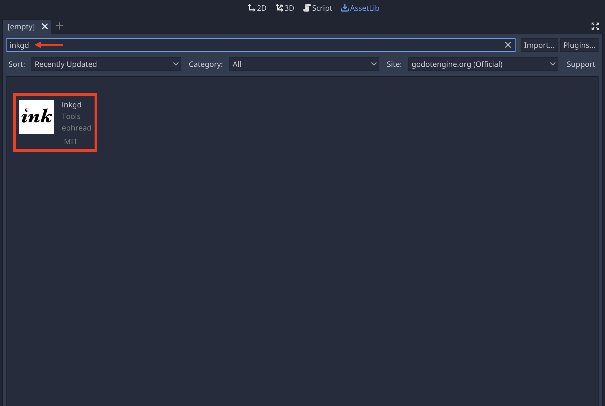
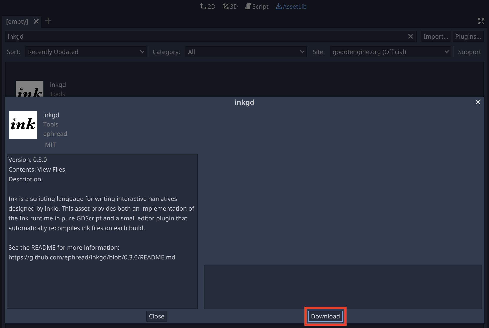
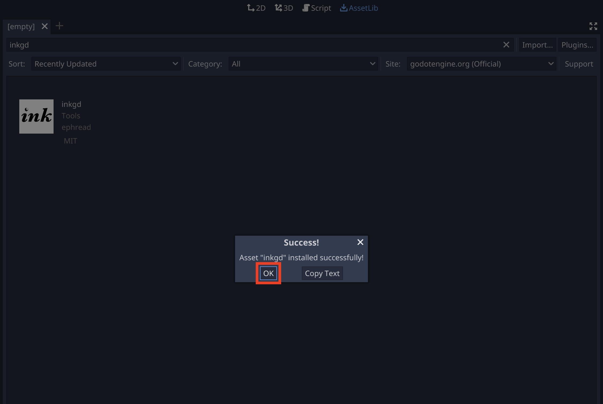
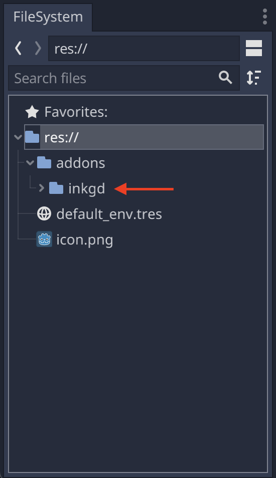
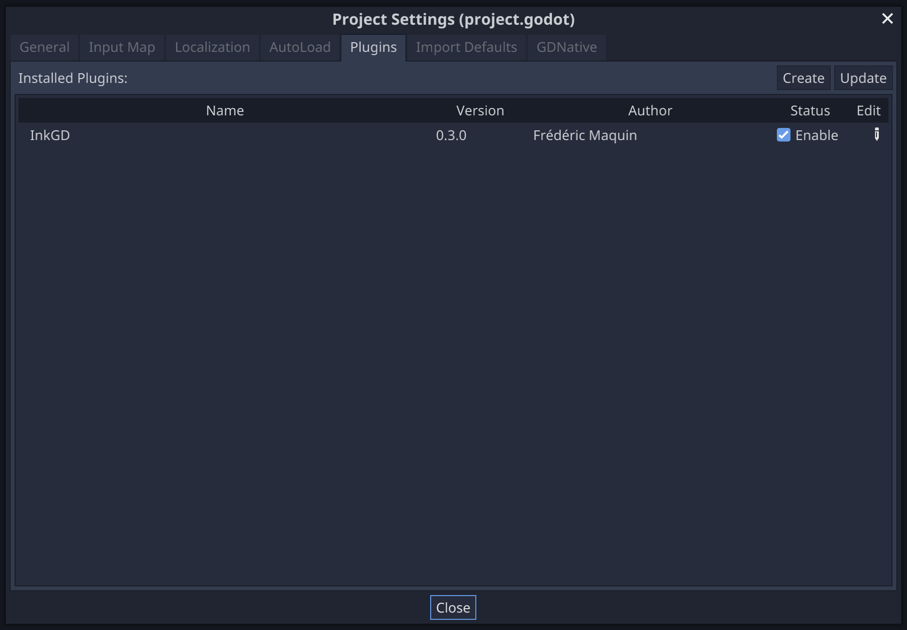
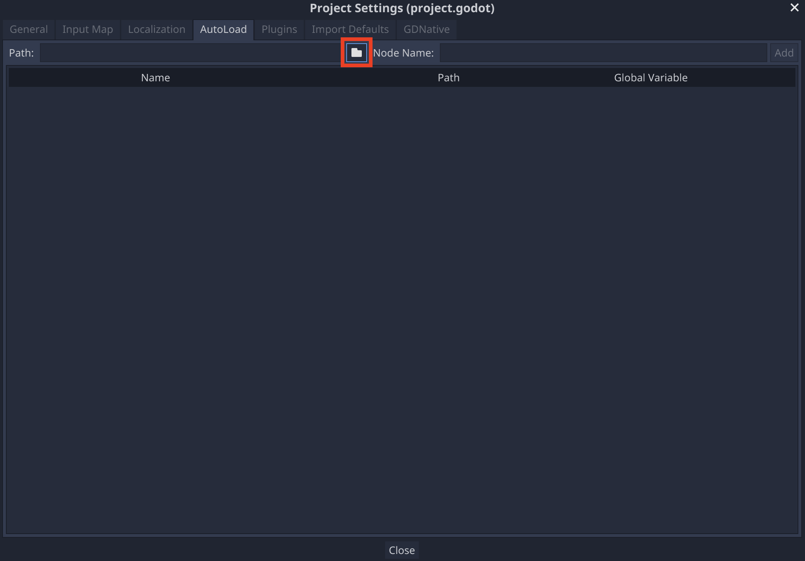
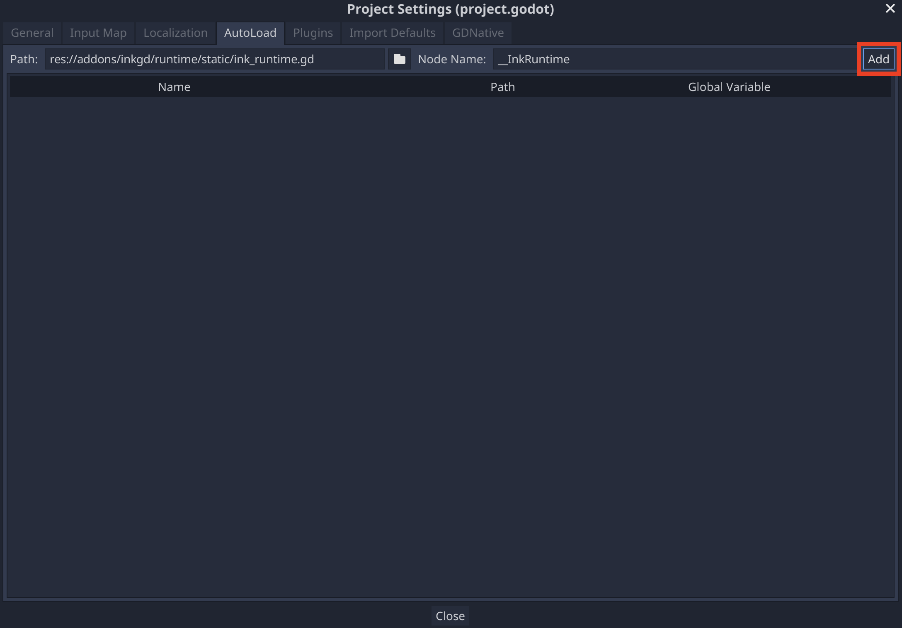
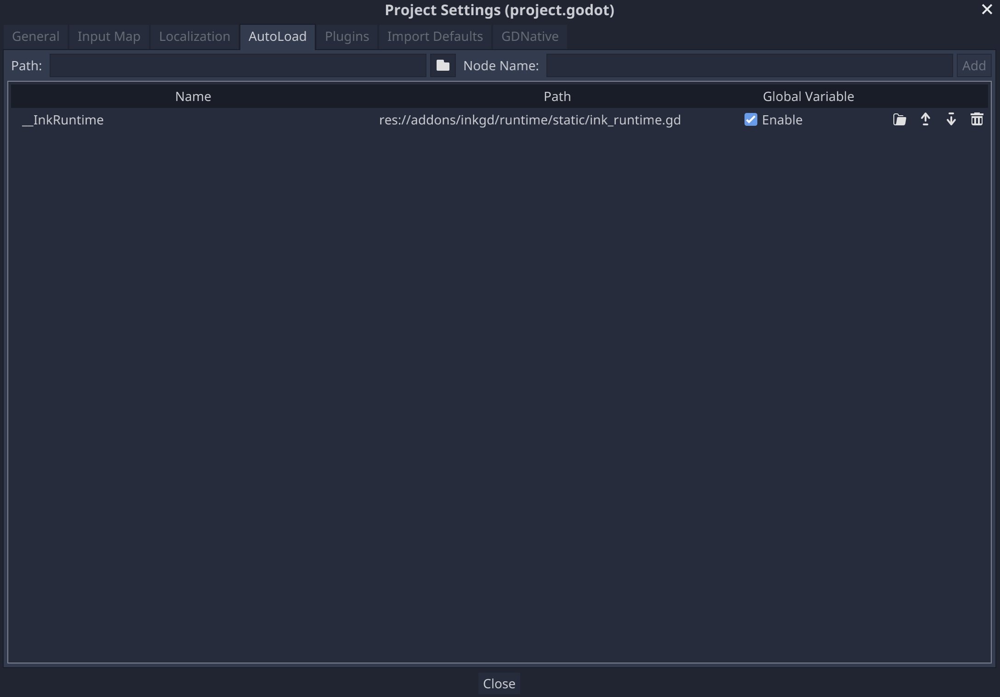

.. Intention: provide the necessary information to set up Ink on Godot.
   We should not tell how to install Ink on any platform, but how to configure
   Ink to be used with Godot.

Introduction
============

This article will help you get started with *inkgd*.

What is *inkgd*?
****************

*inkgd* is an implementation of the Ink_ runtime, in pure GDScript.

.. _Ink: https://github.com/inkle/ink

Once imported, you can use *inkgd* to load and run compiled Ink stories
(files with the ``.ink.json`` extension) inside Godot.

The GDScript API is 100% compatible with the original C# API, with a couple of
minor divergences to accomodate the differences between the two languages. For
more information, see :doc:`/advanced/differences_between_api`.

A typical use of *inkgd* involves calling ``InkPlayer.continue_story()`` until
a branch is found. At this point, an array of choices can be retrieved and
presented to the player. After they made their decision, you can submit the
select choice (represented by the index of the choices array) to the story and
repeat the process (i.e. keep calling ``continue_story`` until another branch
is found).

|

*inkgd* provides no GUI, only text. It's up to you to decide how to present the
content to your players.

Installing the plugin
*********************

You have two ways of installing this plugin: an easy way, through Godot's
Asset Library and a slightly more difficult way, by hand.

The easy way
------------

Open a Godot project, click on the to "AssetLib" tab, at the top of the screen,
then search for "inkgd".

.. image:: img/introduction/asset_lib.png
    :align: center
    :alt: The AssetLib tab, inside Godot.

|

Select "inkgd" from author "ephread".

|

In the popup window, click on "Download".

|

Once the plugin is downloaded, another window will pop up. This window displays
the new file expected to be added to the project. By default, all files should
selected. If this isn't the case, select all the files, then click on "Install".

.. image:: img/introduction/asset_lib_file_section.png
    :align: center
    :alt: Pop up window displaying the file hierarchy of inkgd.

|

After the installation is completed, a confimation dialog should pop up.
Click on "OK" to close it.

|

The new files should appear in the FileSystem dock, under the *addons* folder.

|

*inkgd* also comes with an editor plugin to manage Ink stories. The plugin
should be enabled by default, but it can be disabled from the project settings.
(Project > Project Settings > Plugins).

The editor plugin is not required to use the runtime. Ink stories can be
compiled through ``inklecate`` directly or other editors, such as
Inky_. The resulting ``.ink.json`` file can be imported in the project
as a regular resource.

.. _Inky: https://github.com/inkle/inky/releases

|

The slightly more difficult way
-------------------------------

Use Git to clone this repository:

.. code-block:: console

    $ git clone https://github.com/ephread/inkgd.git

Or download the latest `stable version`_ of *inkgd*, then extract the content
of the archive.

Once you have the content of the repository on your computer, copy the folder
``addons/inkgd`` to ``res://addons/`` in your project.

.. _`stable version`: https://github.com/ephread/inkgd/tags

Initial configuration
*********************

One of the divergences in API mentioned above relates to *static members*.
The orignal C# implementation makes heavy use of static variables, but since
GDScript don't support them, it uses a singleton node instead. This runtime
node must be added to the scene tree before executing any of the methods
of the GDScript API.

There are three major ways to deal with the runtime node.

.. _autoload-singletons:

Project-wide AutoLoad singletons
--------------------------------

If you enabled the editor plugin, the runtime node will be added as an
AutoLoad singleton in your project automatically (unless you manually removed
it afterwards). It's also possible to manually add
``res://addons/inkgd/runtime.gd`` to the AutoLoad list.

|

|

|

When added as an AutoLoad singleton, the node will remain present int the scene
tree even when the current scene is changed.

Using ``InkPlayer``, a convenience node
---------------------------------------

``InkPlayer``, a custom node provided by the plugin, will also add the runtime
node automatically if it's not already present in the scene tree. When added
by ``InkPlayer``, the runtime node will be removed as soon as the node
is itself removed from the scene tree.

Adding the runtime node manually
--------------------------------

If you don't want to use the editor plugin, you will have to manage the runtime
node manually. The simplest way is to add the node to the list of AutoLoad
singletons as described above, but it's also possible to add the node through
scripting. See :ref:`here <ink-runtime>` for more information.

That's it! You can now start using *inkgd* in your Godot scripts.
..Jump over to the next section to create your first game with *inkgd*.
